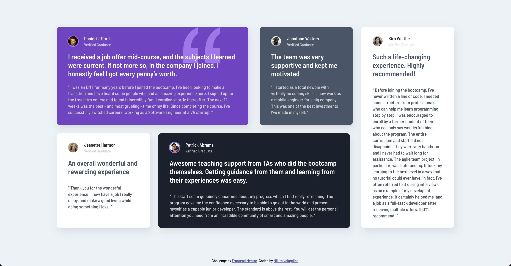

# Frontend Mentor - Testimonials grid section solution

This is a solution to the [Testimonials grid section challenge on Frontend Mentor](https://www.frontendmentor.io/challenges/testimonials-grid-section-Nnw6J7Un7). Frontend Mentor challenges help you improve your coding skills by building realistic projects.

## Table of contents

- [Overview](#overview)
  - [The challenge](#the-challenge)
  - [Screenshot](#screenshot)
  - [Links](#links)
  - [Built with](#built-with)
  - [What I learned](#what-i-learned)
  - [Continued development](#continued-development)
  - [Useful resources](#useful-resources)
- [Author](#author)

## Overview

### The challenge

Users should be able to:

- View the optimal layout for the site depending on their device's screen size

### Screenshot

### Links

- Solution URL: [https://github.com/nikitaVologdin](https://github.com/nikitaVologdin)
- Live Site URL: [https://testimonials-grid-section-gamma-woad.vercel.app/](https://testimonials-grid-section-gamma-woad.vercel.app/)

### Built with

- Semantic HTML5 markup
- CSS custom properties
- Flexbox
- CSS Grid
- Mobile-first workflow

### What I learned

In this project i got a deep dive into grid layout.

### Continued development

Looking forward to use grid knowledge for more complex projects.

### Useful resources

- [An Interactive Guide to CSS Grid](https://www.joshwcomeau.com/css/interactive-guide-to-grid/) - This is another great guide from Josh Comeau. I am enjoying the way complex things get explained in his articles.

## Author

- Website - [Nikita Vologdin](https://vologdin.eu/portfolio)
- Frontend Mentor - [@NikitaVologdin](https://www.frontendmentor.io/profile/NikitaVologdin)
